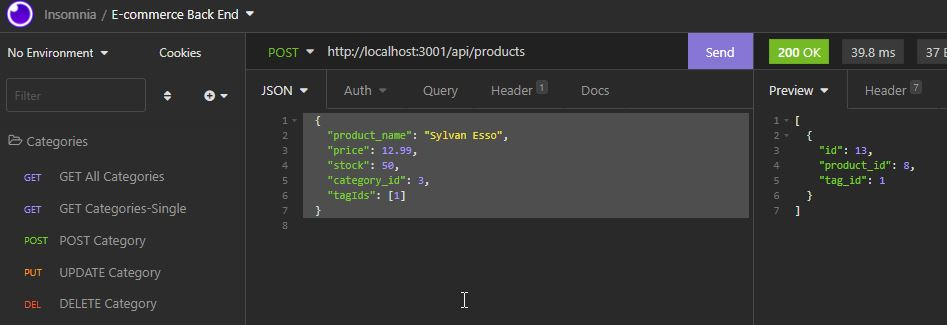

# E-commerce-Back-End

## Overview: 

I connected the back end for an e-commerce site that can be run through the terminal. I took a working Express.js API and configure it to use Sequelize to interact with a MySQL database. A user of the application can now view, add, edit, and delete categories, products and tags.

## Technologies used:
  * SQL 
  * JavaScript
  * Node.js
  * Sequelize
  * Dotenv

Link to video demonstration: 

* Installation Guide: https://watch.screencastify.com/v/wbxqkfWRDd67qlsjGJSI
* Categories CRUD Guide: https://watch.screencastify.com/v/doVzby5bqjk8ew7CDo9w
* Product CRUD Guide: https://watch.screencastify.com/v/wFcdk9oLUBQHfB4wsaWy
* Tags CRUD Guide: https://watch.screencastify.com/v/tobBAucOYYzUtRke4NeV